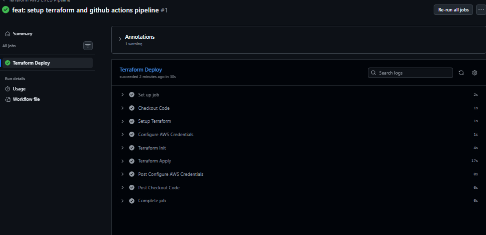
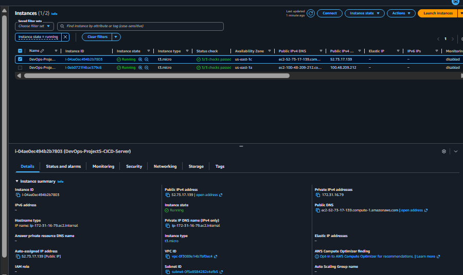

# Automated AWS Infrastructure Deployment via GitHub Actions CI/CD Pipeline

This repository demonstrates a fully automated GitOps CI/CD pipeline that provisions cloud infrastructure on AWS using Terraform and GitHub Actions. No manual terminal execution is required; changes to the infrastructure code automatically trigger deployment.

## 🚀 CI/CD Pipeline Workflow
Every time code is pushed to the `main` branch, GitHub Actions spins up an isolated Ubuntu runner and executes the following pipeline jobs:
1. **Checkout Code:** Pulls the latest infrastructure code from GitHub into the runner.
2. **Setup Terraform:** Installs and configures the Terraform CLI environment.
3. **Configure AWS Credentials:** Securely authenticates with AWS using encrypted repository secrets.
4. **Terraform Init:** Initializes the backend and provider plugins.
5. **Terraform Apply:** Executes the plan with `-auto-approve` to deploy the target infrastructure.

## 🛠️ Tech Stack
* **CI/CD Platform:** GitHub Actions
* **Infrastructure as Code:** Terraform v1.15.6
* **Cloud Provider:** Amazon Web Services (AWS)
* **Secret Management:** GitHub Encrypted Secrets

## 📸 Deployment & Verification Evidence

### 1. GitHub Actions Pipeline Execution Success
All pipeline stages compiled and executed flawlessly within the remote GitHub environment:

### 2. AWS Management Console Verification
Confirmation that the EC2 Instance `DevOps-Project5-CICD-Server` was provisioned automatically via the remote runner:

## 🧹 Infrastructure Decommissioning
Adhering to strict GitOps principles, infrastructure tearing down was handled by removing the resource block from the codebase and pushing the changes, prompting the remote pipeline to safely destroy the active nodes.
